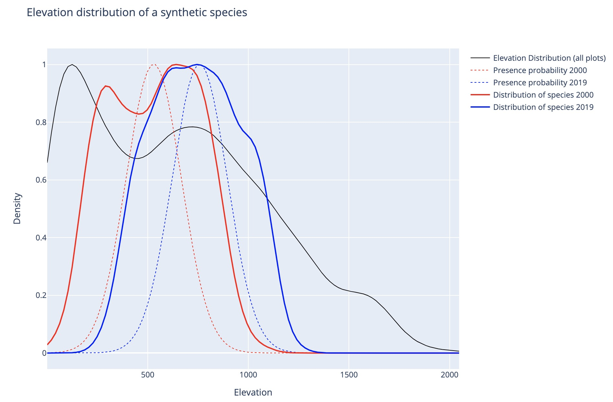
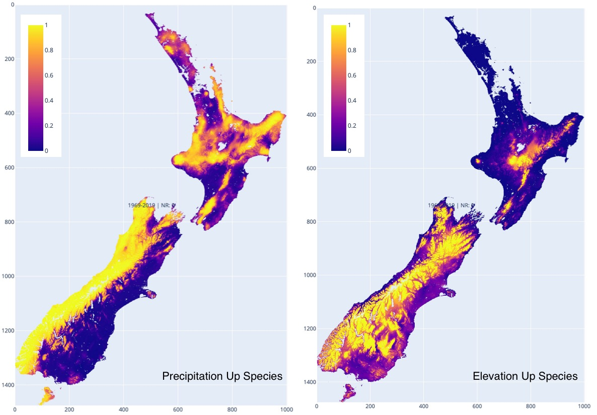
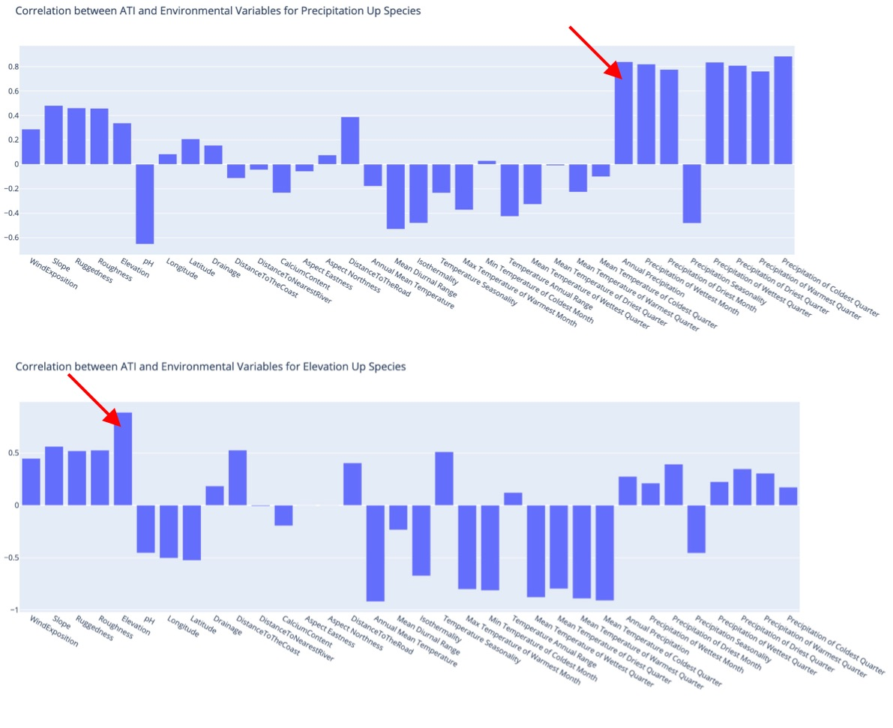

# Abundance Trend Indicator 

This library uses various machine learning models to learn under which environmental conditions a species increases or decreases abundance (classification problem).

We aim to improve the usability and performance of this library. Please do not hesitate to reach out to [Ilya Shabanov](mailto:ilya.shabanov@vuw.ac.nz) for questions or support. 

The details can be found in the accompanying paper: ...add link...

## Installation

1. Check out the repository or clone it to your local machine.

2. Set up a virtual environment (venv) 

```bash
python3 -m venv venv
```
3. Activate the virtual environment

```bash
source venv/bin/activate
```
4. Install the required packages

```bash
pip install -r requirements.txt
```
**Note:** We strongly recommend using an IDE like Pycharm instead of the command line. Activating the virtual environment can be automated.

5. Unpack the demo data to the _data folder in the repository

Download the data from ... 
Unpack to _data folder inside the repository

## Input Data

This repository provides some synthetic data to demonstrate the library’s usage. 

There are three essential datasets you need to provide to run the library:
- Site Data
- Predictor Variables
- Occurrence Data


### 1. Site Data (_data/_input/PlotInfo.csv)
This is a CSV file containing information about forest inventory plots. With the columns `PlotID,ObservationID,Year,mapX,mapY`
- **PlotID** is a unique ID for each plot
- **ObservationID** is a unique ID for each plot survey. The model requires plots to be remeasured at least twice. These plots would have the same PlotID but different ObservationID and Years.
- **Year** is the year of the survey
- **mapX** and **mapY** are the coordinates of the plot. We use pixel coordinates referring to the geotif files provided as predictor variables to avoid any projection errors. Convert your plot locations to pixel coordinates before use.
 

### 2. Predictor Variables (_data/_input/_predictor_variables/**/*.tif)
This is a set of geotiff layers that represent the environmental conditions. All tifs must be in the same resolution. The projection does not matter as we use pixel coordinates.

Layers that do not change over time (e.g. elevation) are stored in a TIF file. The name of the file will be used as the variable’s name throughout the entire analysis. These layers are referred to internally as "GeoLayers.”

Layers that change over time (e.g. annual mean temperature) are stored in a folder. The name of the folder will be used as the variable’s name throughout the entire analysis. The folder contains tif files named as the year they were measured. These layers are referred to internally as "ClimateLayers.”

The library will work regardless of the number or type of layers you provide.

### 3. Occurrence Data (_data/_input/Occurrences.csv)
This CSV file contains forest inventory data for all species with the columns `PlotID,ObservationID,Species,NumIndividuals,Total Diameter`.

- **PlotID** is a unique ID for each plot. Same IDs as in the Site Data.
- **ObservationID** is a unique ID for each plot survey. Same IDs as in the Site Data.
- **Species** is the name of the species.
- **NumIndividuals** is the number of individuals of the species at the site (PlotID) and survey (ObservationID).
- **Total Diameter** is the sum of the diameters of all individuals of the species at the site (PlotID) and survey (ObservationID). This column can be set to 0 if the data is not available. It is only used if the number of individuals does not change and we still want to estimate the abundance change (referred to as **Abundance and DBH** dataset in the paper)

### Synthetic data for testing

The ... archive contains example data and results. Unzip it into the repository's _data folder for testing. It includes parts real and parts synthetic data for testing. 

1. Site data
The site data contains a random subset of real sites from the New Zealand Vegetation survey, but the years and ObservationID are synthetic. The only years present in the data are 2000 and 2019. The observation IDs are identical to the PlotIDs for the year 2000 and set to the negative value for 2019.
2. Predictor variables
The geo layers are taken from [NZENVDS](https://datastore.landcareresearch.co.nz/ne/dataset/nzenvds) and the climate layers are generated from [HOTRUNZ](https://essd.copernicus.org/articles/14/2817/2022/essd-14-2817-2022-discussion.html).
These values contain accurate data.
3. Occurrence data 
The occurrence data is synthetically generated for an "Elevation Up Species" and a "Precipitation Up Species" that shift along a hypothetical elevation or precipitation gradient, respectively. It is generated using the following method: 
- First, estimate the elevation or precipitation distributions of all plots in the site data and obtain their mean M and standard deviation S. 
- Then generate two Gaussian presence probability distributions, "2000" and "2019". The 2000 distribution is set to μ = M - 0.5*S, and the 2019 distribution is set to μ = M + 0.5*S. Both distributions have a standard deviation of σ = S*0.3.    
- A subset of plots where the species is assumed present is then drawn from each distribution generating the occurrence data.

The resulting elevational distribution of the synthetic species is shown in the figure below.




## Usage and model training

The model goes through a series of steps: first, preprocess the data into the necessary format, then train the models, and finally, make predictions. 
Each step generates a set of files stored in the _data folder. 

The complete workflow is in the `main.py` file; detailed explanations of the respective steps are in the paper’s methods section.

## Parameters

All algorithmic parameters are stored and described in the `GlobalParams.py` file. Before running the pipeline, check the file and ensure 
the parameters are set for your needs. Most settings are hyperparameters that have been optimised and presented in the paper, but some parameters
are dataset-specific and might need to be adjusted.

### Min and Max year
These settings define the range of years that are considered in the analysis. Set them to the period of your data
```python
maxYear = 2020
minYear = 1969
```

### Parallel Processing

This defines the number of CPUs that will be used for parts of the code that have been parallelised. Set it to the number of available CPUs, especially if running on an HPC cluster.
```python
parallelProcesses = 8
```

### Minimum number of observations

As described in the paper the model requires a minimum number of observations to be present for a species to be included in the analysis.
The model also requires a minimum number of observations per class (Increase, Decrease) to be present.
While the model will work with fewer observations, the results will be less reliable and may vary more strongly with the (random) choice of test and training sets.
If you need more reliable results, you can increase these values at the expense of the number of species that can be included in the analysis.

```python
minObservationsTotal = 100
minObservationsPerClass = 20
```

The observations per class should be set to a value in the same order of magnitude as the number of observations per class in the smallest species to avoid a strong class imbalance.
For example, suppose a species has 1000 observations but only 20 increases. In that case, the class imbalance will lead to most models simply predicting the majority class, as the minority class is too small to contribute significantly to the loss function.

### Prediction Threshold

A prediction result with an AUC score of 0.7 (see reasoning in the paper) or below is considered unreliable/unlearnable. Species models with a score below this threshold are excluded from prediction.
Increase this value to focus only on species where the models show higher confidence. The AUC score is between 0 and 1, where 1 is a perfect model, and 0.5 is a random one.

```python
predictionThreshold = 0.7
```

## Models

The library can use a variety of models to learn the problem, even though the random forest model usually seems to be the best option. 
However, for testing, it might make sense to use less powerful models with fewer hyperparameters to tune them so that they run orders of magnitude faster (like the linear model) while providing acceptable results for some species.

The models and the range of their hyperparameters are defined in `classifierDefinitions.py`. 
The name constants for new models can be added in the `ModelType` class (`Enums.py`)

An example definition for the random forest looks like this:

```python
GridSearchCV(RandomForestClassifier(),
param_grid={"max_depth": [4, 5, 6, 7, 8, 9, 10],
"n_estimators": [50, 100, 200, 300, 400, 500],
'min_samples_split': [2, 5, 10]},
cv=5),
```

Hyperparameters are tried out in a grid search with 5-fold cross-validation; adding or removing values will influence the runtime of the training.

The number of jobs will be set to the setting in `GlobalParams.py` at runtime.

Any model that is compatible with scikit-learn can be used.

## Evaluation of the results

The final result consists of:
1. A model for each species that can predict the abundance trend of the species and can be probed using explainable AI methods [Molnar 2022](https://christophm.github.io/interpretable-ml-book/) to derive feature importances.
2. A predicted ATI value (0-1) for each species across the entire study area and period, where values above 0.5 indicate an increase in abundance and values below 0.5 indicate a predicted increase in abundance.

The models are stored in `_data/_models`.
The predictions are stored in `_data/_predictions/_ati`.

Generally, it would be best not to load any of the *.pickle files directly but use the various FileID classes (in `FileIDClasses.py`) that take the parameters as input and generate the paths where the models are stored.
If only some parameters are provided to any FileID classes, they can list all possible values for the missing parameters. For example, if you do not give a species name, the ModelFileID class can locate all models for all species where the rest of the parameters match your requirements.

Example for loading a prediction and a model
```python
# Loading a model 
mid = ModelFileID(Species=..., NoiseRemovalBalance=..., NoiseReduction=..., Classifier=..., Variables=..., Dataset=..., ClassificationProblem=...)
TrainedModel.load(mid.file)

#Loading a prediction
mmp = ModelMeanPredictionFileID(Years=..., NumNeighbours=..., Metric=..., Species=..., Variables=...)
ModelMeanPrediction.load(mmp.file)
```
From these, various interpretations and plots are possible. Please see the [Dash app](https://github.com/lnilya/ati-dash-app/), which presents results from the paper as examples and explanations. The compiled interactive version can be found online [here](https://ati-nz-predictions-7e6f3d514735.herokuapp.com/).  

### Example results for the synthetic data

To see the results for the two synthetic species that shift their range up in elevation or precipitation respectively, run the `result.py` file.

The result is the ATI prediction for the two species across the entire study area and period and the correlation between ATI values and the respective environmental variable.

Areas above 0.5 indicate an increase in abundance, and the two synthetic species increase their abundance at higher altitudes (see especially the mountain range on the South Island) and in areas of high precipitation (see the South Island's rainy west coast).



A correlation of ATI values with the different environmental variables can be computed to quantify the result further. 
Unsurprisingly, the highest correlations with ATI for the two species come from elevation and temperature (Elevation Up Species) and various precipitation variables (Precipitation Up Species).



Note that for a simple synthetic species, the results are quite clear. For real species, the results will be more complex and require noise reduction of the data.

### What can be evaluated?

1. **Correlation between ATI values and environmental variables**: Indicate which areas are conducive to a species’ growth or death. 
2. **Feature importances of the models**: Indicate which environmental variables are most important for predicting the species abundance trend.
3. **Maps of the predicted ATI values**: Show areas where a species is expected to increase or decrease in abundance. 
4. **Marginals of the ATI values**: By creating a kernel density estimate along any (or multiple) environmental variables with the ATI values as weights, it is possible to identify thresholds in the environmental variables that indicate a change in the species abundance trend.
5. **Scores of the models**: Models with lower scores can indicate species less influenced by the environmental predictor variables and possibly subject to other factors not included in the analysis (e.g. biotic interactions). 

Please do not hesitate to contact the authors for further information on how to interpret the results and what interpretations can be made.

This library contains only minimal code for plotting the results. The Dash App explains different ways to plot and interpret the results.

